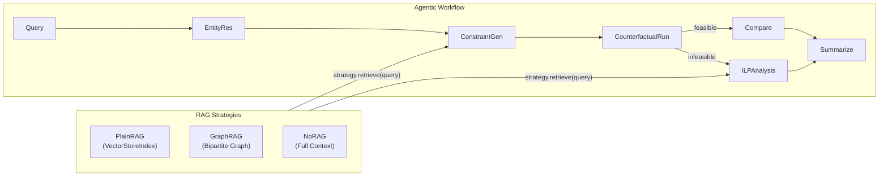

# Graph RAG Comparison Framework

## Architecture Overview

The core idea is a **RAG strategy abstraction** that lets the workflow be parameterized with different retrieval approaches. The workflow itself stays unchanged — only the retrieval mechanism swaps out.

## 1. RAG Strategy Protocol

Create `agentic_explain/rag/strategy.py`:

- `RetrievedChunk` dataclass: `text`, `score`, `metadata`
- `RAGStrategy` Protocol with two methods:
  - `retrieve(query, top_k) -> list[RetrievedChunk]` — returns scored chunks
  - `name` property — returns strategy name for logging ("plain_rag", "graph_rag", "no_rag")

All three strategies implement this protocol. The workflow nodes call `strategy.retrieve()` instead of `rag_index.as_retriever()`.

## 2. Plain RAG Strategy

Create `agentic_explain/rag/plain_rag.py`:

- Wraps the existing `VectorStoreIndex` in the `RAGStrategy` protocol
- `retrieve()` calls `index.as_retriever(similarity_top_k=k).retrieve(query)` and converts to `RetrievedChunk`
- `build_plain_rag(py_path, lp_path, mps_path, data_dir, persist_dir)` — factory that builds/loads the index and returns a `PlainRAGStrategy` instance
- Reuses existing `agentic_explain/rag/build_index.py` internally

## 3. Graph RAG Strategy

See plan file `2_hierarchical_graph_rag_refinement.plan.md` for the refined two-level hierarchical graph design. High level:

- Create `agentic_explain/rag/graph_rag.py`
- Level 1 type nodes + Level 2 entity-group nodes (~212 nodes), three edge types, 1-hop expansion retrieval
- LP-derived edges; `extract_constraint_instances()` in `lp_parser.py`

## 4. No-RAG Strategy

Create `agentic_explain/rag/no_rag.py`:

- `retrieve()` always returns the full `FORMULATION_DOCS` string (from `staffing_model.py`) as a single chunk plus the index mapping document
- Score is always 1.0 (no retrieval ranking)
- Factory: `build_no_rag(py_path, data_dir)` — reads formulation docs + index mapping

## 5. Refactor Workflow to Accept RAG Strategy

- `workflow/graph.py`: `create_workflow()` parameter `rag_index: Any` -> `rag_strategy: RAGStrategy`
- `workflow/nodes.py`: `make_constraint_generation_node(rag_strategy, ...)` and `make_ilp_analysis_node(rag_strategy, ...)` call `rag_strategy.retrieve(query, top_k=5)`; store `rag_strategy.name` in `rag_retrieval_debug`

## 6. Extract Notebook Helpers

- `workflow/debug.py`: `print_retrieval_debug`, `print_llm_messages`, `print_applied_constraints`, `print_comparison`, `print_workflow_summary`
- `evaluation/helpers.py`: `load_eval_queries`, `run_single_query`, `format_query_result`, `run_batch_evaluation`

## 7. Comparison Notebook

Create `notebooks/RAGComparison.ipynb`: Setup, build all 3 strategies, inspect, single-query comparison, batch evaluation, results analysis.

## 8. Clean Up Old Notebook

Update `AgenticExplainability_Usage.ipynb`: use extracted helpers, point to RAGComparison.ipynb for evaluation.
